# Employee Management System

## Project Overview

Employee Management System is a Flask-based web application developed as part of an internship project. The system provides secure authentication, employee management, profile management, RESTful APIs, and a modern responsive user interface.

## Features

### Authentication

* Secure Login
* Logout
* Session Management
* Password Hashing
* Role-Based Access

### Admin Features

* Admin Dashboard
* Add Employee
* View Employees
* Edit Employee
* Delete Employee

### Employee Features

* Employee Dashboard
* View Profile
* Update Profile

### REST APIs

* GET /api/employees
* GET /api/employees/<id>
* POST /api/employees
* PUT /api/employees/<id>
* DELETE /api/employees/<id>

## Technology Stack

* Frontend: HTML, CSS, JavaScript, Bootstrap
* Backend: Flask
* Database: SQLite
* ORM: SQLAlchemy
* Authentication: Session-Based Login
* Deployment: Render
* Version Control: GitHub

## Live Deployment

https://employee-management-system2-2g9z.onrender.com

## Screenshots

### Home Page

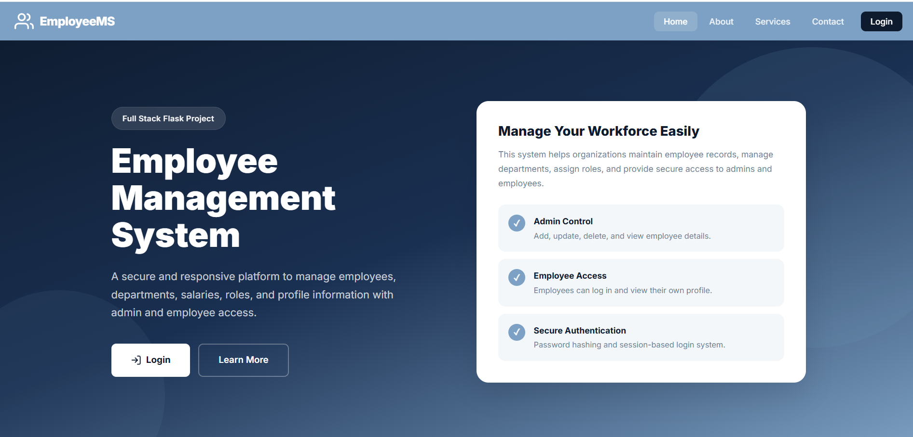

### About Page

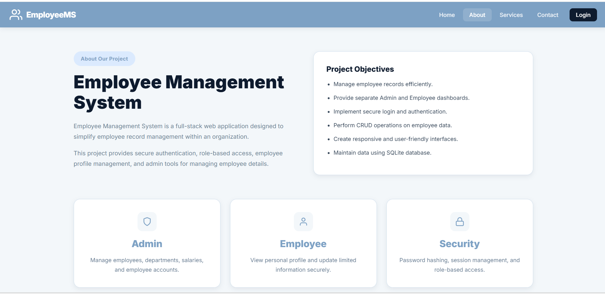

### Services Page

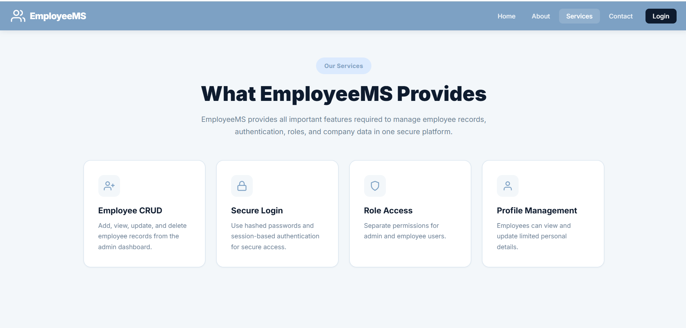

### Contact Page

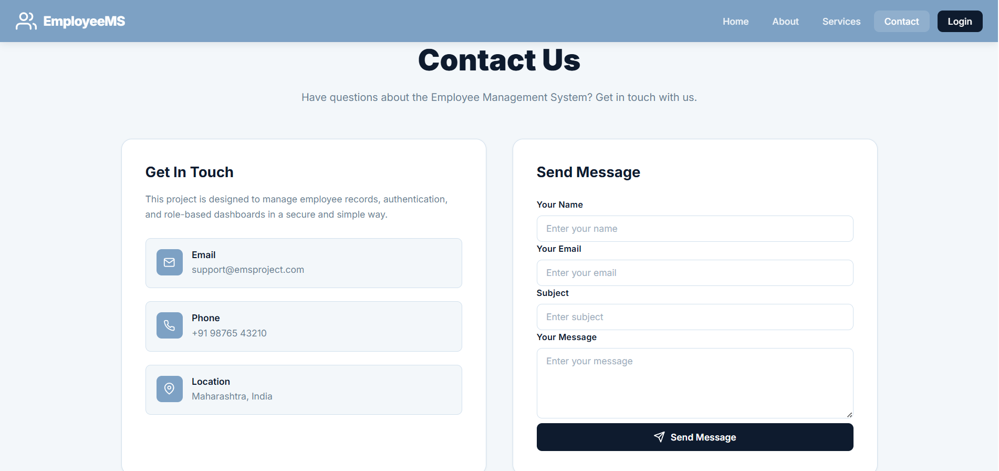

### Login Page

### Admin Dashboard

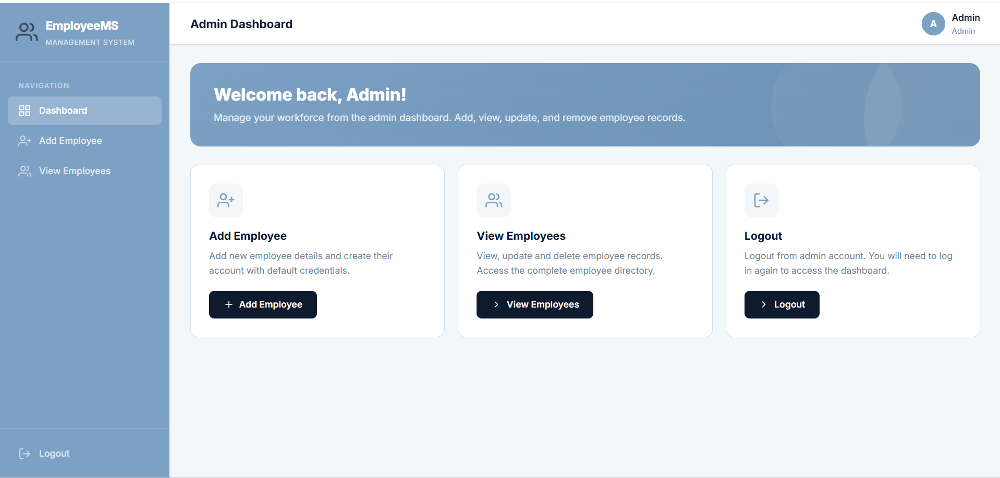

### Add Employee

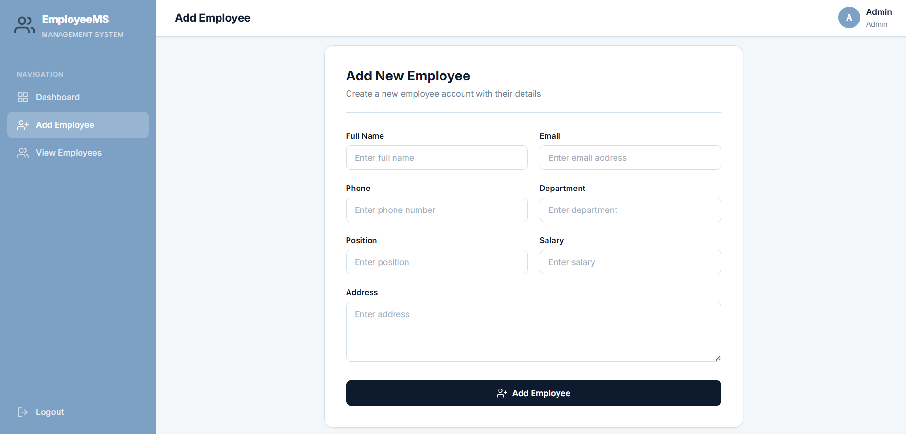

### Employee List

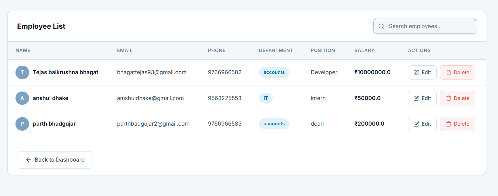

### Edit Employee

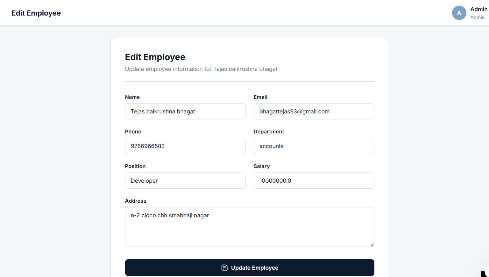

### Employee Dashboard

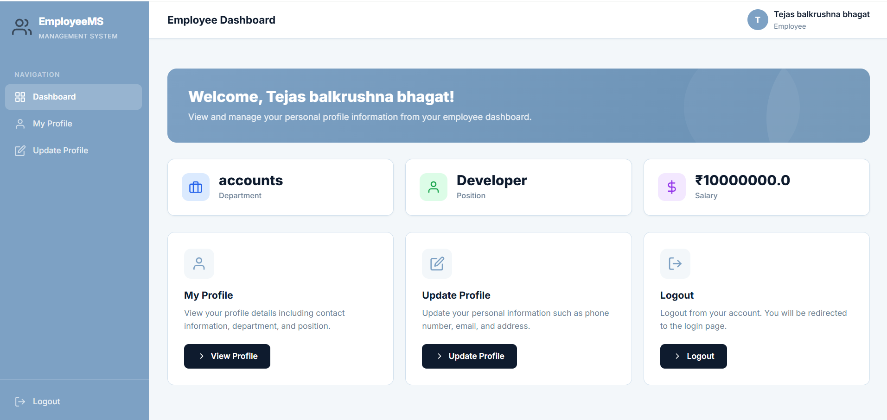

### Profile Page

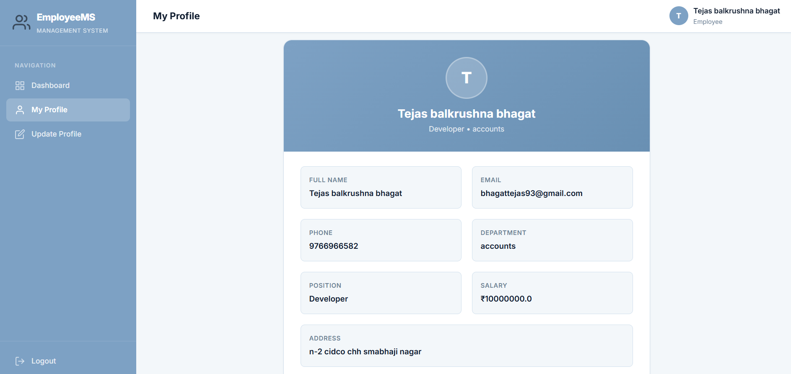

### Edit Profile Page

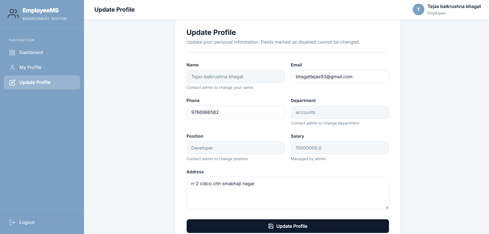

### GET API

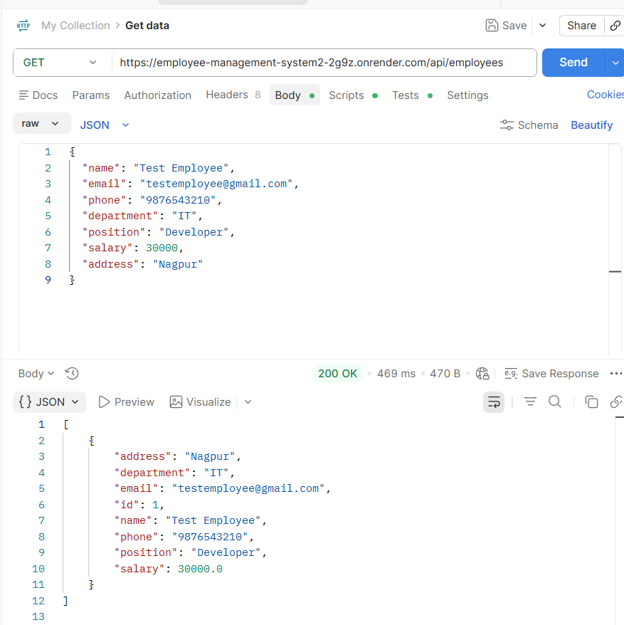

### POST API

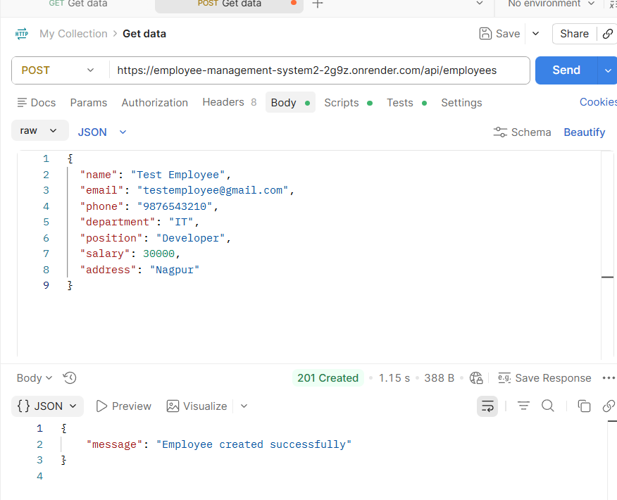

### PUT API

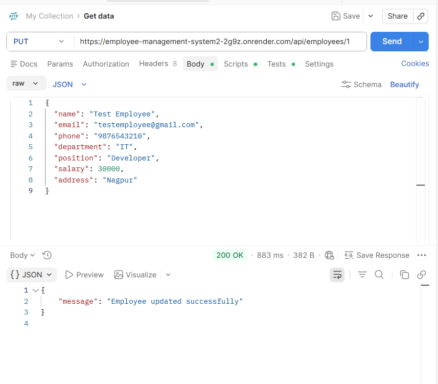

### DELETE API

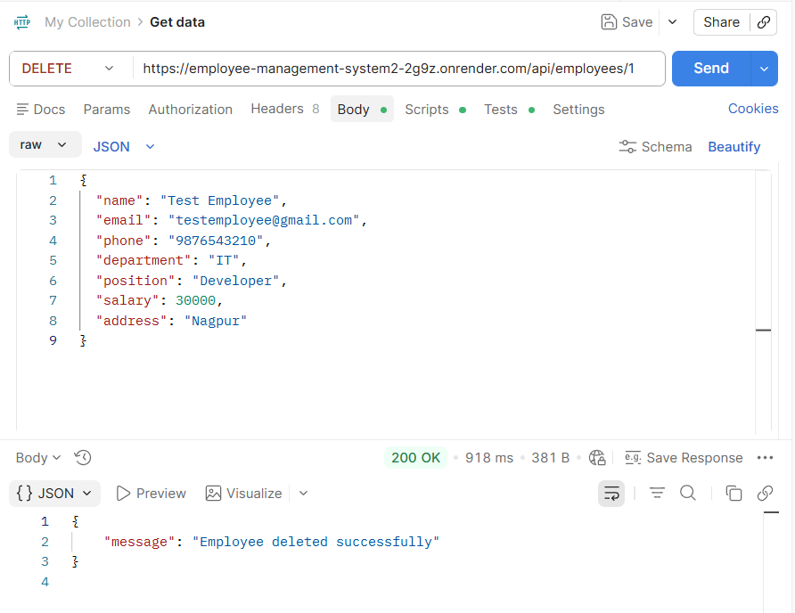
